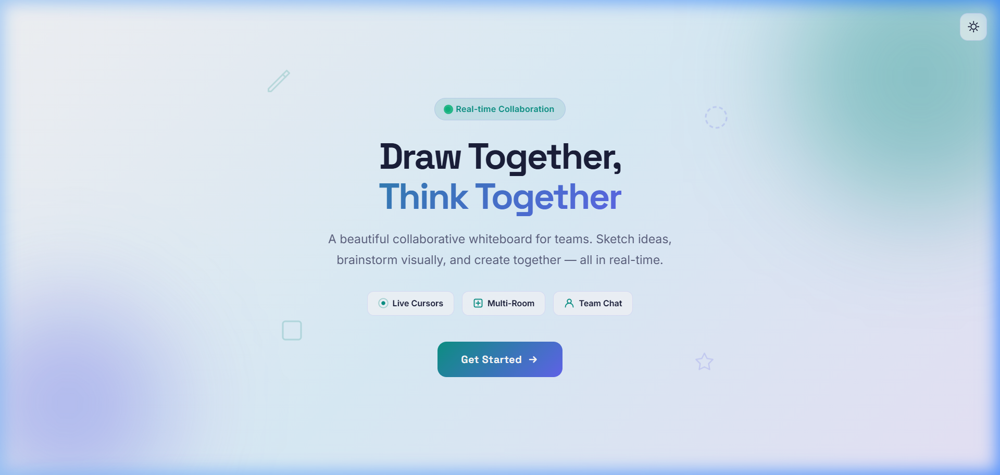
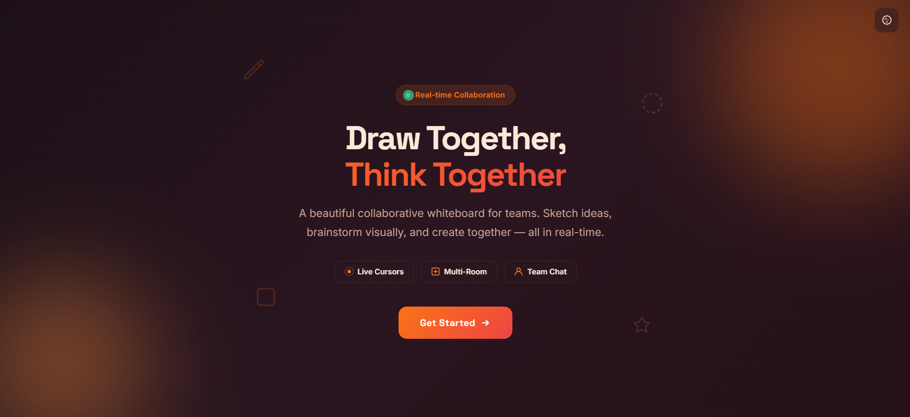
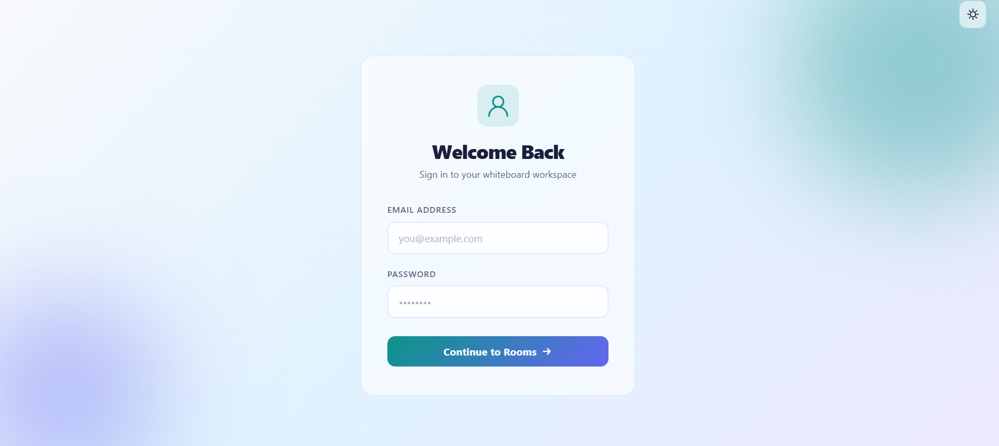
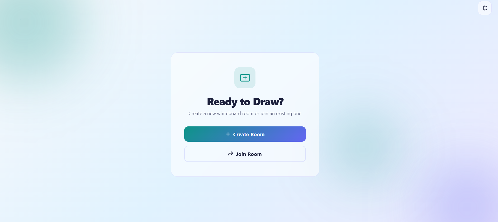
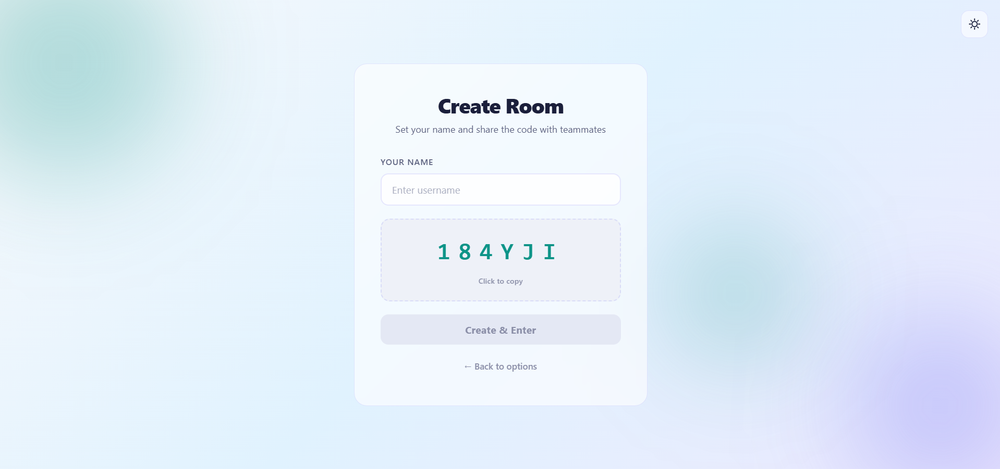
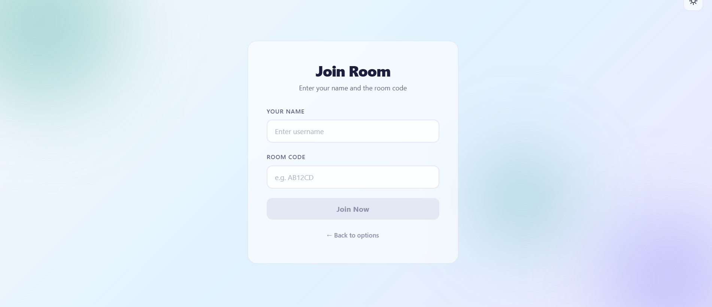
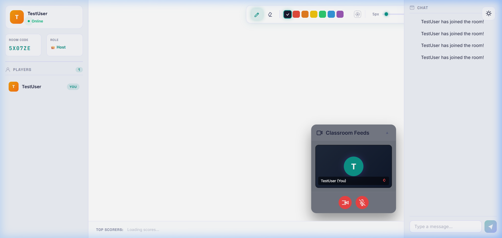
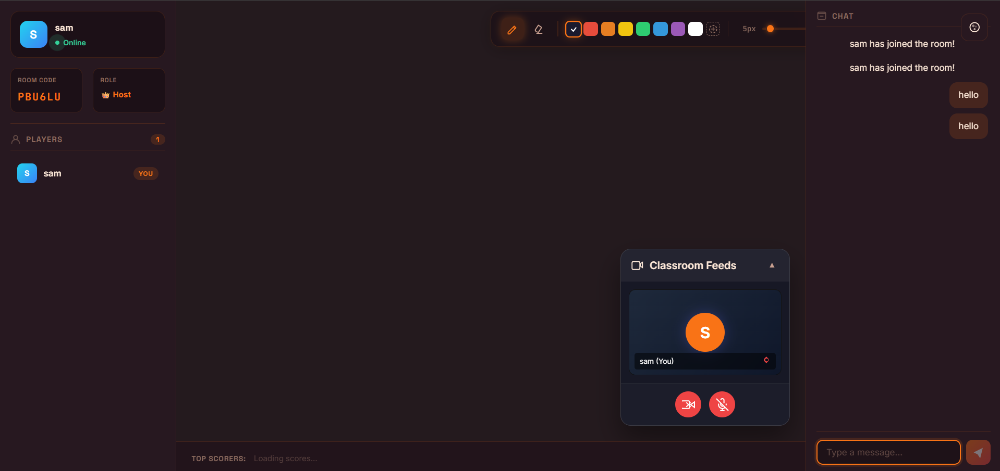

# 🎨 Real-Time Whiteboard Game

A multiplayer drawing and guessing game like Skribbl.io.

## 🚀 Features
- **Real-time Drawing**: Seamless synchronization using WebSockets.
- **Multiplayer Rooms**: Create or join rooms with unique codes.
- **Interactive Chat**: Built-in chat system for communication.
- **Dual Mode Support**: Beautifully crafted Light and Dark modes.

## 🖼️ Project Gallery

### 🏠 Landing & Authentication
| Landing Page (Light) | Landing Page (Dark) | Login Page |
| :---: | :---: | :---: |
|  |  |  |

### 🔑 Room Management
| Ready to Draw | Create Room | Join Room |
| :---: | :---: | :---: |
|  |  |  |

### 🎨 Whiteboard Experience
| Main Interface | Real-Time Drawing | Dark Mode Whiteboard |
| :---: | :---: | :---: |
|  |  |  |

## 🔄 Working Flow

1.  **Authentication**: Users start at the landing page and can proceed to login.
2.  **Room Selection**: Choose between creating a new room or joining an existing one.
3.  **Room Setup**:
    - **Create**: Get a unique Room Code to share with friends.
    - **Join**: Enter the Room Code shared by the host.
4.  **Collaboration**: Once inside, draw on the canvas in real-time, change colors, adjust brush size, and chat with other players.

## 🛠️ Tech Stack
- **Frontend**: React.js
- **Backend**: Spring Boot
- **Communication**: WebSockets (STOMP/SockJS)

## ▶️ How to Run the code

### Backend
1. Navigate to the backend folder: `cd backend`
2. Run the application: `mvn spring-boot:run`

### Frontend
1. Navigate to the frontend folder: `cd frontend`
2. Install dependencies: `npm install`
3. Start the dev server: `npm run dev`